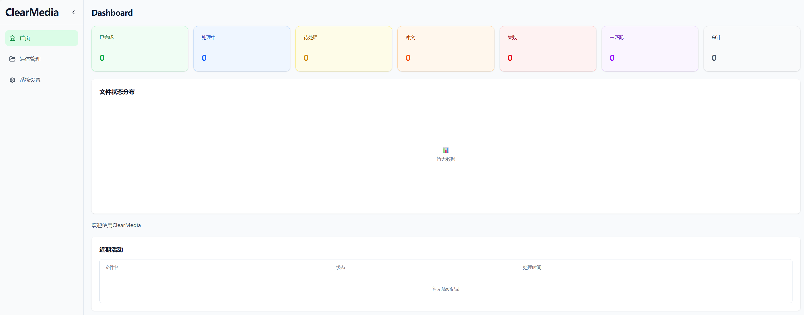

# ClearMedia

ClearMedia 是一个全栈应用程序，旨在自动扫描、丰富和组织您的媒体库。它结合了强大的 FastAPI 后端和现代化的 React 前端，提供无缝的媒体管理体验。



## 核心功能

-   **📂 自动扫描**: 将 ClearMedia 指向您的媒体目录，它将自动检测新文件。
-   **🧠 智能丰富**: 从 **TMDB** 获取丰富的元数据，并利用 **LLM** 来分析和标记您的媒体。
-   **✨ 智能整理**: 自动将您的文件重命名并整理到一个清晰的、用户定义的目录结构中。
-   **🖥️ 现代化 UI**: 一个基于 React 的响应式界面，用于监控进度、查看统计数据和管理您的媒体库。
-   **🚀 Docker 化部署**: 使用单个 `docker-compose` 命令，在几分钟内启动并运行。
-   **🔧 动态配置**: 无需重启应用，即可从 UI 即时调整系统设置。

## 技术栈

-   **后端**: Python, FastAPI, SQLModel
-   **前端**: React 19, TypeScript, Vite, Tailwind CSS
-   **数据库**: SQLite (默认)
-   **容器化**: Docker & Docker Compose

## 使用 Docker 快速启动 (推荐)

使用 Docker 部署是上手的最简单方法。

1.  **克隆仓库**:
    ```bash
    git clone https://github.com/your-username/clearmedia.git
    cd clearmedia
    ```

2.  **配置环境**:
    从示例文件创建 `.env` 文件。此文件控制 API 密钥、媒体路径和其他关键设置。
    ```bash
    cp .env.example .env
    ```
    现在，用您偏好的设置编辑 `.env` 文件。

3.  **构建并运行**:
    使用 Docker Compose 构建镜像并启动服务。
    ```bash
    docker compose build --parallel
    docker compose up -d
    ```

4.  **访问应用**:
    -   **前端 UI**: `http://localhost:5173`
    -   **后端 API**: `http://localhost:8000/api`

### 管理服务

-   **查看日志**: `docker compose logs -f`
-   **停止服务**: `docker compose down`

## 本地开发

适用于贡献者或偏好手动运行服务的用户。

### 先决条件

-   Node.js >= 20 & pnpm >= 10
-   Python 3.11+ & [uv](https://github.com/astral-sh/uv)

### 设置

1.  **安装依赖**:
    在项目根目录，安装前端和后端的依赖。
    ```bash
    pnpm install
    ```

2.  **配置环境**:
    将 `.env.example` 复制为 `.env` 并进行自定义。由 `uv` 运行的后端服务器将自动加载它。

3.  **运行后端**:
    此命令会以热重载模式启动 FastAPI 服务器。
    ```bash
    uv run uvicorn main:app --app-dir backend --reload --port 8000
    ```

4.  **运行前端**:
    此命令会启动 Vite 开发服务器。
    ```bash
    pnpm -F frontend dev
    ```

-   **前端**: `http://localhost:5173`
-   **后端 API**: `http://localhost:8000`

## 生成 API 类型

为确保前后端同步，您可以从后端的 OpenAPI 规范重新生成 TypeScript 类型。

```bash
pnpm gen:types
```
此命令将获取最新的 API 规范并更新 `frontend/src/types/openapi.d.ts`。